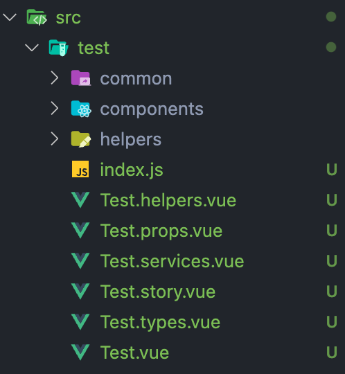
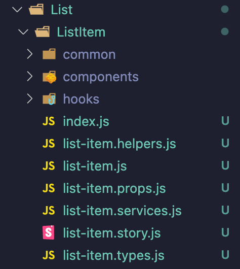

# Template builder for React

<a href="https://codeclimate.com/github/lgtome/templates-builder/test_coverage"></a>

[](https://wallabyjs.com/oss/)


### [Package] which generate templates via config file and argv

## Table of Contents

-   [Get Started](#get-started)
-   [Usage](#usage)
-   [Config](#config)
-   [Available Template Variables](#vars)
-   [Templates](#templates)
-   [Preview](#preview)
-   [Future Goals](#goals)
-   [Contribution](#contribution)
-   [License](#license)

## <a name="get-started"></a>Get started

Install **templates-builder** with npm:

```sh
npm install --save templates-builder
```

or using yarn:

```sh
yarn add templates-builder
```

## <a name="usage"></a>Usage

Extended description and usage of this, see: [Config](#config)

Use **default** preset or use **config** like:

```json
{
    "adjustVars": ["index", "props", "styles", "stories"],
    "entry": "src",
    "transformType": "kebab",
    "extension": "js",
    "framework": "vue",
    "folders": "['components', 'services', 'helpers', 'graphql', '__tests__']",
    "fileNameSeparator": ".",
    "reExport": true,
    "templates": "path/to/your/templates"
}
```

### Quick guide

**Provide** your path includes your `entry` in the config, or default entry value, if no entry, is an `src`, and execute like this:

```sh
yarn tb enter/your/path/...
```

or use package.json scripts:

```json
...
{
    "scripts":{
        ...
        "generate:template": "yarn tb ..."
        ...
    }
}
...
```

## <a name="config"></a> Config

### Sample config filename:

-   `tb.config.json`

### Config Options:

| Config option         | Requirements |           Available types           |  Defaults   |                                                               Meaning |
| :-------------------- | :----------: | :---------------------------------: | :---------: | --------------------------------------------------------------------: |
| **entry**             |   `false`    |              `String`               |    `src`    |                 Absolute directory from which the files are generated |
| **adjustVars**        |   `false`    |           `Array<String>`           | `['index']` |                                       Sub-files, like props or styles |
| **transformType**     |   `false`    | `kebab or snake or pascal or camel` |   `camel`   |                                              Names transform strategy |
| **extension**         |   `false`    |             `js or ts`              |    `js`     |                                                       Files extension |
| **framework**         |    `true`    |           `react or vue`            |   `react`   |                                            Framework based generation |
| **folders**           |   `false`    |              `String`               |    `[]`     |                     Additional folders, which will be on the endpoint |
| **templates**         |   `false`    |              `String`               |    `{}`     | Path to the templates files, json format, see [Templates](#templates) |
| **fileNameSeparator** |   `false`    |           `. or - or _ `            |     `.`     |                                           Filename separator strategy |
| **reExport**          |   `false`    |              `Boolean`              |   `true`    |                  Creates index file, which re-export fn from the main |

## <a name="templates"></a>Templates

Your config file with your own templates to every file, or exactly for only one.

### Template filename and extension:

-   `*.js`

### Accepted exports:

-   `export const ...`

-   `export {...}`

-   `export default {...}`

### Allowed variables:

-   `$FILENAME$` - filename

-   `$EXTENSION$` - file extension

-   `$relation$` - relation to the main file, used only in `index` template

### Example:

If you set to the config `adjustVars`, for example, `index` and `style` you can provide the same vars to the template, like this:

```js
const index = `some template`
const style = 'styles template'

export default { style, index }
```

Also you can pass variables, like this:

```js
export const props = '$FILENAME$ is a props file with $EXTENSION$ extension'
export const index = `$relation$ relation to main file`
```

## <a name="preview"></a>Preview

-   Files with or without folders
-   Each file have a template, also u can provide variables: `$filename$`
-   _Result may vary because config may vary_

    

    

## <a name="contribution"></a>Contributing

In an active search for contributors and I will be glad to support the package.

**Follow this flow:**

-   Fork this repository
-   `git clone` your fork
-   `npm install` or `yarn install` make your changes
-   Update `CHANGELOG.md` commit and make a pull request

#### Currently working on

-   Tests
-   Support folder file structure

## <a name="license"></a>License

[MIT-licensed](./LICENSE).

[web workers]: https://developer.mozilla.org/en-US/docs/Web/API/Web_Workers_API/Using_web_workers
[package]: https://www.npmjs.com/package/templates-builder
